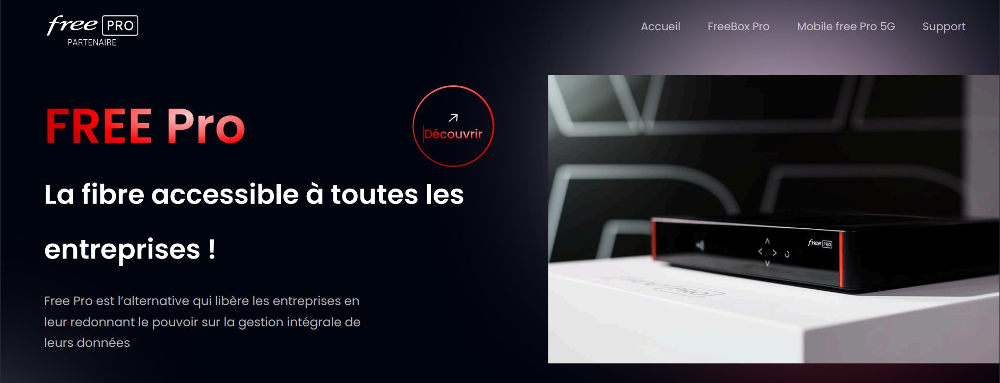
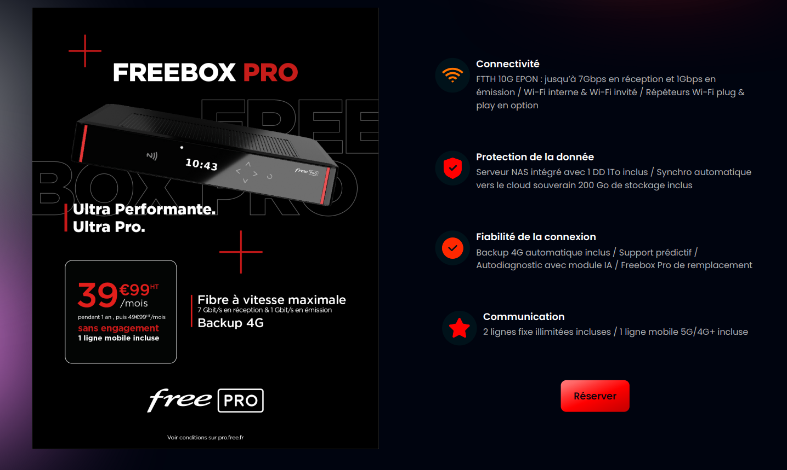
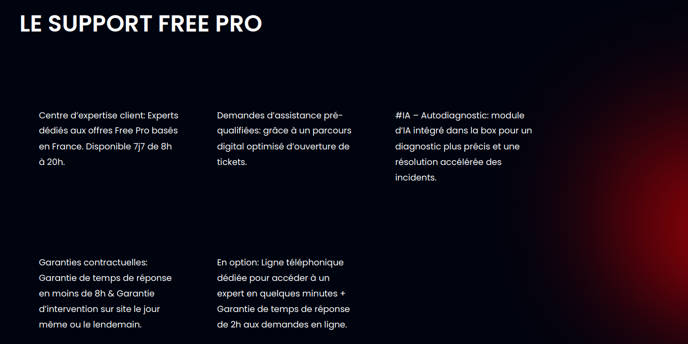
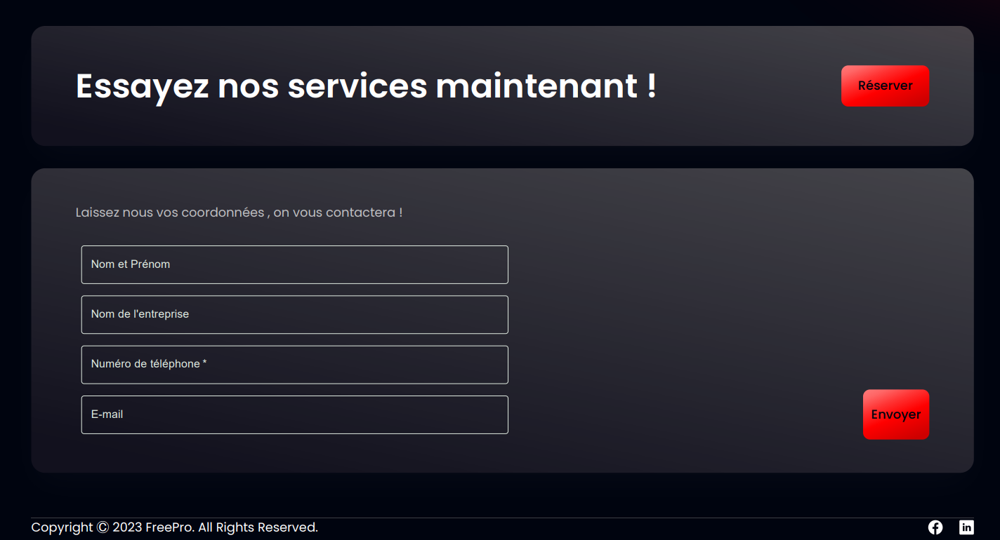

# FreePro Tunisia Website

This project is a showcase website for FreePro, highlighting their business solutions. 
The site provides detailed information on their offerings, including high-speed fiber connectivity, data protection, reliable connections, and communication services. 
It also features a mobile 5G service, expert support options, and an easy-to-use contact form. 
The site is designed to help businesses discover and engage with FreePro's services effectively.

# Demo

..

..

..

..

Check the FreePro_Website.pdf for a full overview.